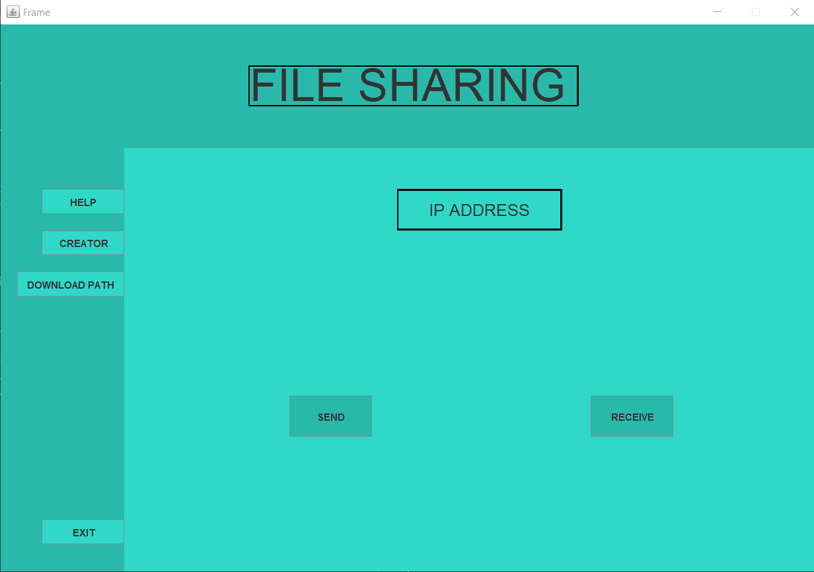

# File_Transfer_Software
 This software is made by me and my friend(batchmate) which makes file transfer between two computers possible by simply connecting via same wifi. 

# Some snapshots of the software

### Landing page of the software

### Send Page

#### Connection and File choosing

  
  

### Receive Page

#### Connection in receiver page

  

